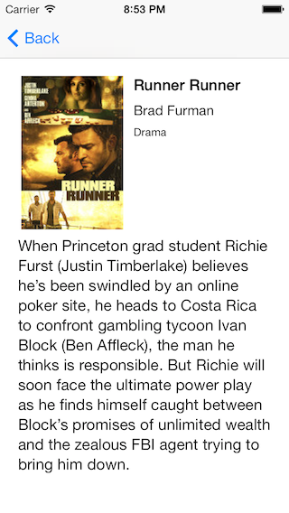

books-and-movies
================

books-and-movies is a simple master-detail app that pulls books and movies from a JSON feed, lists them in a table view, and shows a lil' detail about them. If you're new to iOS, you can learn about a few key technologies you'll use in almost any app you build by reading through this README. And you should definitely clone this repo and run the app to see it for yourself.

## Getting started

1. Clone the repo
2. Double-click on MasterDetail.xcodeproj to open the project in Xcode
3. Run the app with ⌘R (Command-R). Or if you like clicking things, click the big "play" button in the upper left corner of Xcode.
4. Look at Main.storyboard to see how the app is laid out visually.
5. Look at IDTViewController to see the networking and table view code.
6. Look at IDTDetailViewController to see where the text and image come from for the labels and image view on the detail screen.

## Explanation of Technologies Used

Most of the apps you build will use UIKit, which is the built-in UI library for iOS. Additionally, if you do any sort of networking in an app, you'll likely be using NSURLSession. And if that networking is pulling JSON from a server (or sending JSON *to* a server), you'll probably use NSJSONSerialization. From UIKit to NSURLSession to NSJSONSerialization, you can't go wrong with [books-and-movies](https://github.com/iOSDevTraining/books-and-movies). :)

### UIKit

As Apple describes it, UIKit is "the primary API for implementing the user interface in an iOS app." Below are screen shots of the two screens in the app and explanations of the UIKit elements that make them up.

**The Master view** (pictured above) uses two key elements of UIKit: UITableView and UISegmentedControl. UITableView is used in tons of apps on the App Store, plus many of Apple's built-in apps, like Mail, Contacts, and Settings. And UISegmentedControl (that blue control that says "Movies" and "Books" in the top of the master screen shot above) is used almost as frequently. It can be seen in apps like Maps (hit the info button to see Standard | Hybrid | Satellite in a segmented control) and Safari (on the Bookmarks screen, it's the Bookmarks | Reading List control at the top).

**The Detail view** (pictured above) shows examples of UIImageView and UILabel, both part of UIKit. The UIImageView is the view that displays the book/movie cover art. All of the text elements on the detail screen are UILabels.

### NSURLSession

The data for the table view is fetched with the help of NSURLSession, which is a wonderful new class in iOS 7 that makes HTTP requests so much nicer than with NSURLConnection, its nasty predecessor. (It's actually only nasty *now* because we have NSURLSession - note that it wasn't all that awful before we knew any better.) See IDTViewController for more on how to make HTTP requests with NSURLSession.

### NSJSONSerialization

JSON serialization in iOS is really quite simple thanks to NSJSONSerialization which turns plain ol' JSON into instances of NSDictionary, NSArray, NSString, NSNumber, and everybody's favorite: NSNull. The example here shows that, but NSJSONSerialization can also go the other way, turning your NSDictionary, NSArray, NSString, NSNumber, and NSNull objects into a lovely chunk of UTF-8 encoded data (NSData).

## A note on the JSON data

The data from this app comes from Apple's [iTunes RSS Feeds](https://rss.itunes.apple.com/us/), where you can generate feed URLs for a variety of media types on iTunes. In this app, we've taken the generated RSS Feed URL and replaced the "xml" at the end with "json" and found that that little hack works nicely to give us the data we want as JSON. Here's a URL for the Top Paid Books: https://itunes.apple.com/us/rss/toppaidebooks/limit=10/json

## Issues, Suggestions, Comments, or Questions?

If you have issues, you can file them in this repository's [issue tracker](https://github.com/iosdevtraining/books-and-movies/issues). Otherwise, you can send suggestions, comments, or questions to [@iOSDevTraining](https://twitter.com/iosdevtraining) or [iOSDevTraining@roadfiresoftware.com](mailto:iOSDevTraining@roadfiresoftware.com).

## About

This was made just for you by [Josh Brown](https://twitter.com/jtbrown) and [Randy Edmonds](https://twitter.com/apphands). We teach workshops on iOS - find out more at [iOSDevTraining.com](http://iosdevtraining.com/).

You should definitely [follow us on Twitter](https://twitter.com/iosdevtraining).
